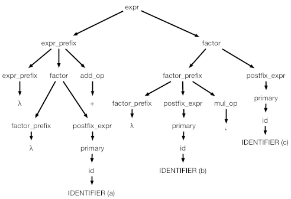
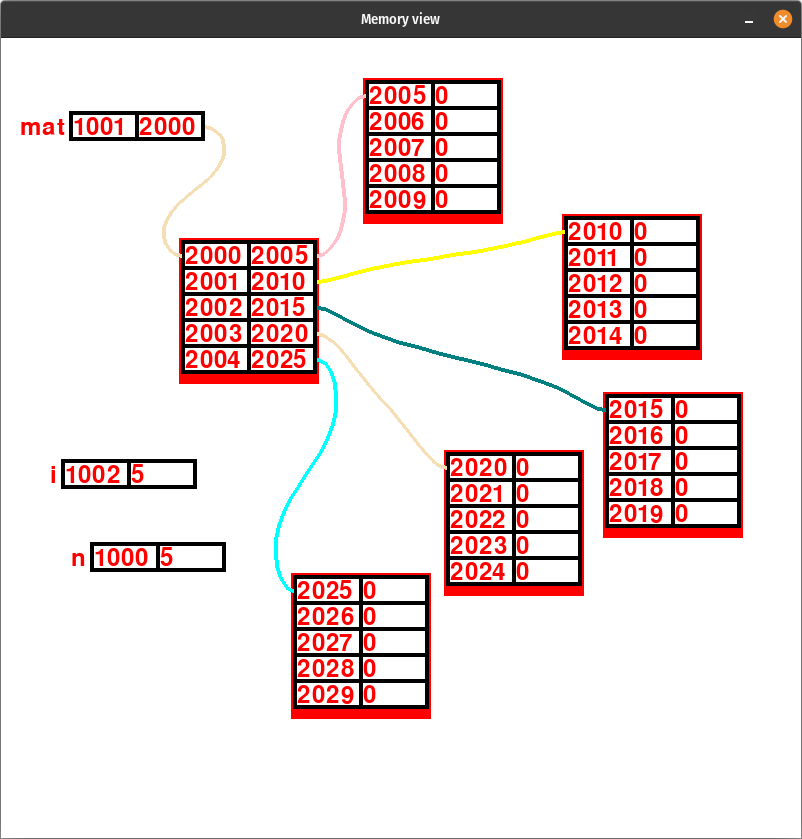
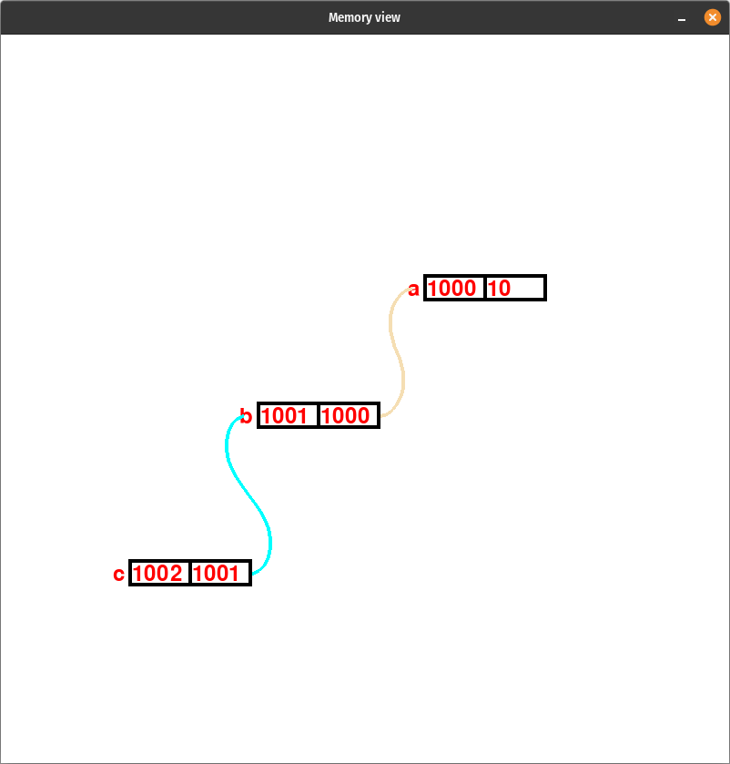
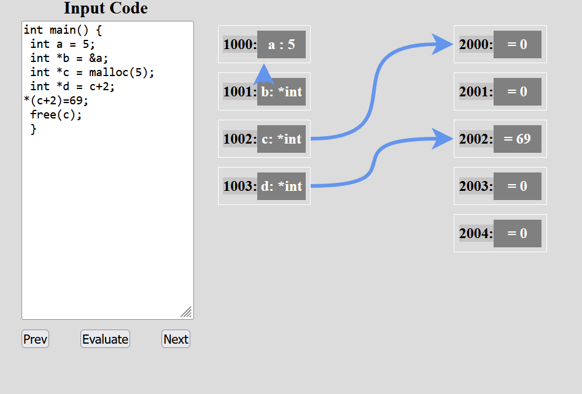
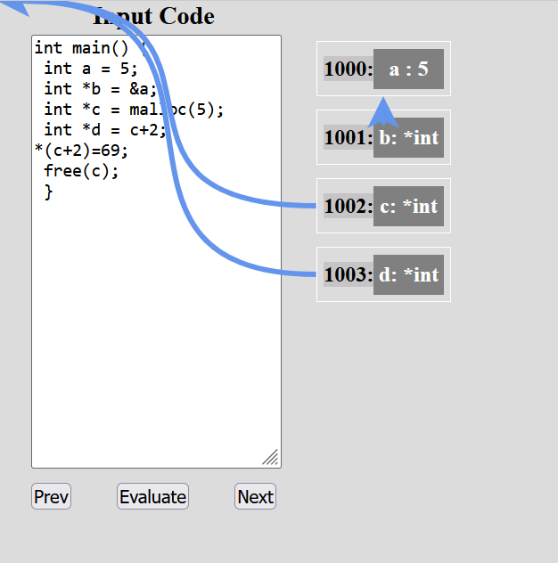

# MATFHakaton2023-lovacG5

## AST - Abstract Syntax Tree

<p float="left" align="middle">
  
</p>

## Desktop PyQt application

<p float="left" align="middle">
  
  
</p>

### Running the **desktop** application
Dependencies: Python, PyQT5, Pygame
```
pip install pygame
pip install PyQt5
```
Run th ecode:
```
python main.py
```

## React Web Application
<p float="left" align="middle">
  
  
</p>

<!--
## Running the **web** app
### Requierments
        pip install fastapi
        pip install "uvicorn[standard]"

        npm i react-xarrows

### How to run
        Execute python ./backend/api.py  in order to run the server that parses the json representation of AST.
        Then run npm start inside of the frontend directory.
-->